

  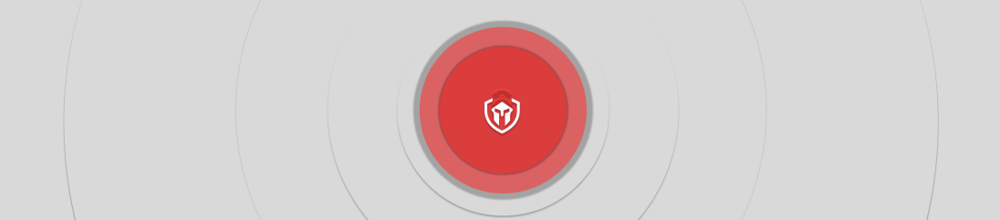

  <h1 style="margin: 0;">REDHELM 321</h1>  
  
*Connecting Lives, Securing Tomorrow.*

---

### 📑 Table of Contents
1. [Introduction](#introduction)  
2. [Features](#features)  
   - [🔒 Authentication](#authentication)  
   - [🔗 Connect](#connect)  
   - [📌 Status](#status)  
   - [👤 Profile](#profile)  
   - [📱 Widget Support](#widget-support)  
3. [Technologies Used](#technologies-used)  
   - [🛠️ Development Tools and Frameworks](#development-tools-and-frameworks)  
     - [Android Studio](#android-studio)  
     - [Java](#java)  
     - [Kotlin](#kotlin)  
     - [XML](#xml)  
   - [☁️ Backend and Database](#backend-and-database)  
     - [Firebase](#firebase)  
   - [📍 Geolocation and Mapping](#geolocation-and-mapping)  
     - [Google Maps API](#google-maps-api)
4. [App Preview](#app-preview)     
5. [REDHELM 321 Developers](#redhelm-321-developers)  
6. [Acknowledgments](#acknowledgments)  

---

<h2 id="introduction">🚀 Introduction</h2>

<strong>REDHELM 321</strong> is an innovative application designed to seamlessly integrate communication, safety, and connectivity. By leveraging modern technology, it empowers users to broadcast their presence, connect with others nearby, and share crucial updates about their well-being. Whether you're reaching out for help, marking yourself safe, or building new connections, Redhelm ensures that you're always in touch with the people who matter most.

---

<h2 id="features">🛠️ Features</h2>

<h3 id="authentication">1. 🔒 Authentication</h3>
<ul>
  <li>Login Using Google: Effortlessly log in using your Google account for secure access.</li>
</ul>

<h3 id="connect">2. 🔗 Connect</h3>
<ul>
  <li><strong>Broadcast Your Device:</strong> Share your location/presence with nearby users.</li>
  <li><strong>Connect Nearby:</strong> Communicate directly with nearby users without requiring Wi-Fi or mobile data by leveraging Wi-Fi Direct technology.</li>
  <li><strong>Scan and Connect:</strong> Discover and connect with nearby users in real time.</li>
  <li><strong>Make a Conversation:</strong> Start a chat with your connections instantly.</li>
  <li><strong>Send Friend Requests:</strong> Expand your network by sending friend requests.</li>
</ul>

<h3 id="status">3. 📌 Status</h3>
<ul>
  <li><strong>Mark Safe:</strong> Let others know you are safe with a single click.</li>
  <li><strong>Need Help:</strong> Notify your network or send an alert when assistance is required. This feature includes a loud audible sound to attract immediate attention during emergencies.</li>
  <li><strong>View Friends' Status:</strong> Stay updated on your friends' safety statuses.</li>
</ul>

<h3 id="profile">4. 👤 Profile</h3>
<ul>
  <li><strong>Edit Your Profile:</strong> Update your personal details to reflect your latest information.</li>
  <li><strong>Share Your Account Using QR:</strong> Easily share your profile with others using a QR code.</li>
  <li><strong>Add Friends Using QR:</strong> Quickly add new friends by scanning their QR codes.</li>
  <li><strong>View Contacts:</strong> Access a list of your friends and connections conveniently.</li>
</ul>

<h3 id="hotlines">5. 📞 Hotlines</h3>
<ul>
  <li>Access a curated list of important emergency hotlines, such as police, fire, and medical services, directly from the app.</li>
  <li>Quickly dial emergency numbers in moments of crisis with one tap.</li>
</ul>

<h3 id="widget-support">6. 📱 Widget Support</h3>
<ul>
  <li>Add REDHELM as a widget on your home screen for instant access to status updates, connections, and quick actions.</li>
</ul>

---

<h2 id="technologies-used">🖥️ Technologies Used</h2>

<h3 id="development-tools-and-frameworks">🛠️ Development Tools and Frameworks</h3>

<h4 id="android-studio">1. Android Studio</h4>
<ul>
  <li>The official IDE for Android development, providing a robust environment for building and testing the application.</li>
</ul>

<h4 id="java">2. Java</h4>
<ul>
  <li>A foundational programming language used for the core functionality and business logic of REDHELM.</li>
</ul>

<h4 id="kotlin">3. Kotlin</h4>
<ul>
  <li>A modern language complementing Java, offering concise syntax and enhanced safety features.</li>
</ul>

<h4 id="xml">4. XML</h4>
<ul>
  <li>Extensively used for UI design and defining application resources.</li>
</ul>

<h3 id="backend-and-database">☁️ Backend and Database</h3>

<h4 id="firebase">5. Firebase</h4>
<ul>
  <li>Google's backend-as-a-service platform for authentication, real-time data syncing, cloud storage, and push notifications.</li>
</ul>

<h3 id="geolocation-and-mapping">📍 Geolocation and Mapping</h3>

<h4 id="google-maps-api">6. Google Maps API</h4>
<ul>
  <li>Enables location-based features, such as visualizing connections and navigating user locations.</li>
</ul>

---

  <h2>📱 App Preview</h2>
  
Explore the key features of REDHELM 321 with the following screenshots and descriptions:

<!-- Three-row Grid Layout using Table -->
<table>
  <tr>
    <td style="text-align: center;">
      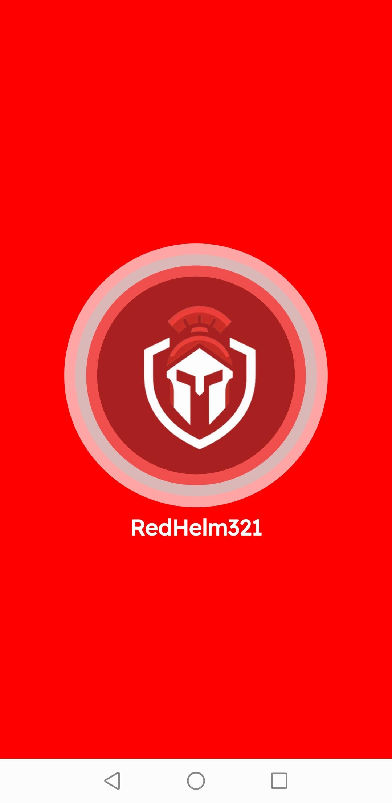
      
Splash Screen

    </td>
    <td style="text-align: center;">
      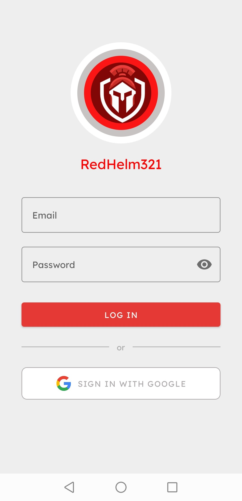
      
🔒 Authentication

    </td>
    <td style="text-align: center;">
      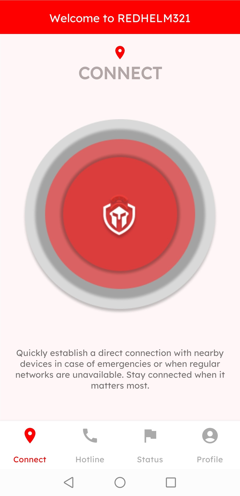
      
🔗 Connect

    </td>
  </tr>
  <tr>
    <td style="text-align: center;">
      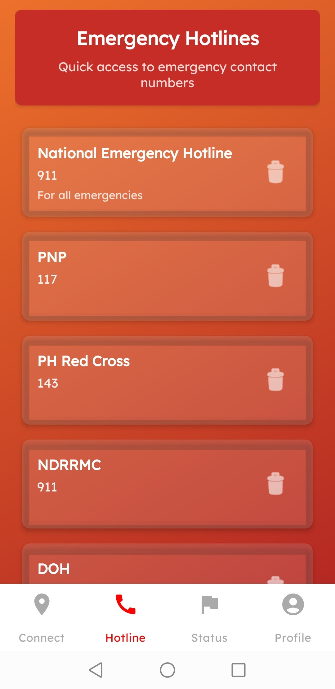
      
📞 Hotlines

    </td>
    <td style="text-align: center;">
      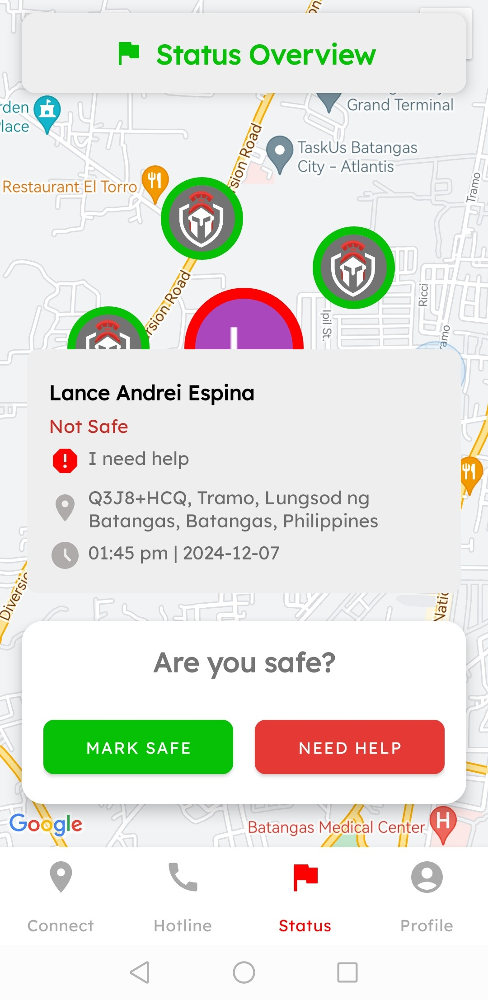
      
📌 Status

    </td>
    <td style="text-align: center;">
      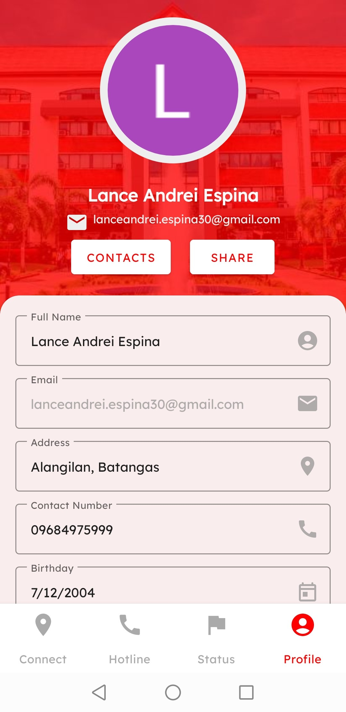
      
👤 Profile

    </td>
  </tr>
  <tr>
    <td style="text-align: center;">
      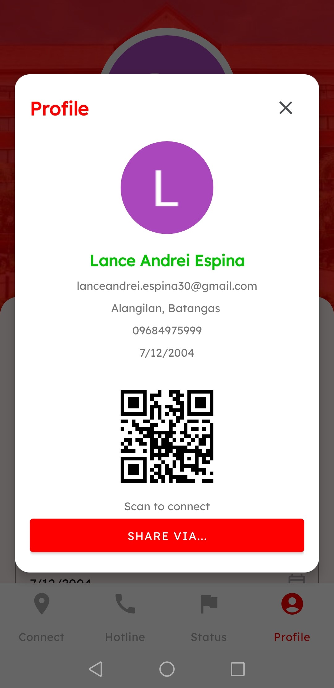
      
🤝 QR Sharing

    </td>
    <td style="text-align: center;">
      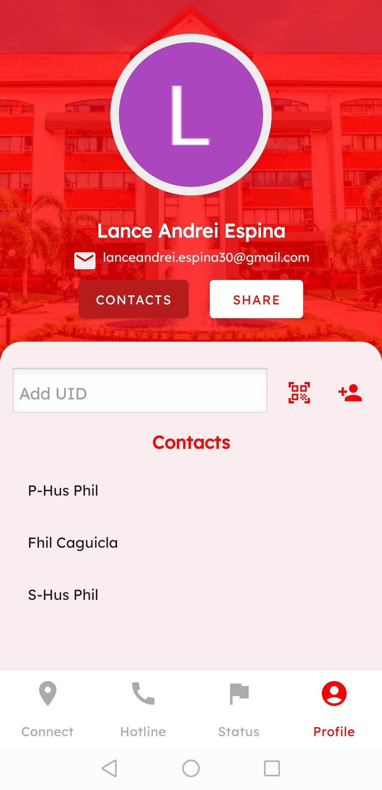
      
📇 Contacts

    </td>
    <td style="text-align: center;">
      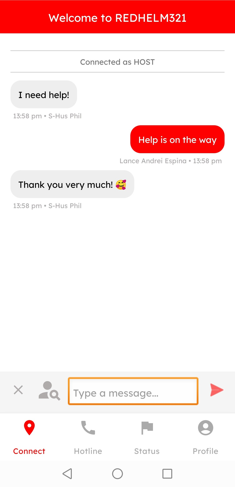
      
💬 Messages

    </td>
  </tr>
</table>

<!-- Combined Table Layout for Video and Additional Images -->
<table>
  <!-- Video Section (Thumbnail as Link) -->
  <tr>
    <td colspan="3" style="text-align: center;">
      <!-- Video Link (Thumbnail as a Clickable Link) -->
      
      
📹 Scanning Nearby Devices

    </td>
  </tr>

  <!-- Additional Images Section -->
  <tr>
    <td style="text-align: center;">
      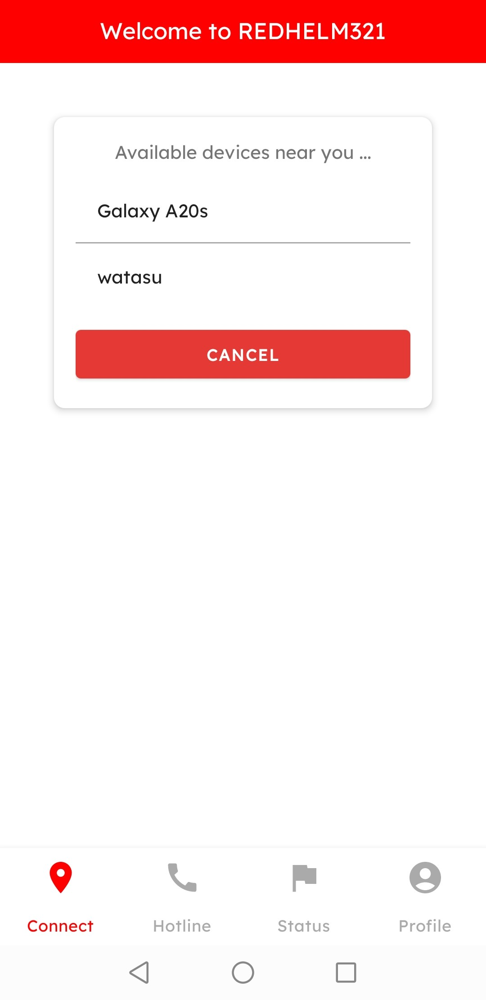
      
📱 Connected with available devices

    </td>
    <td style="text-align: center;">
      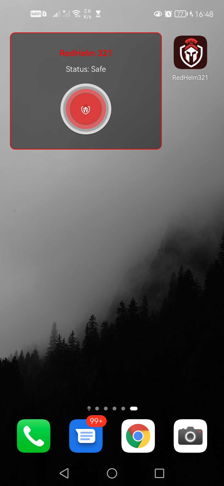
      
📱 Widget Feature

    </td>
    <td style="text-align: center;">
      <!-- Empty cell for spacing, if needed -->
    </td>
  </tr>
</table>

<h2 id="redhelm-321-developers">💻 REDHELM 321 Developers</h2>

- **Espina, Lance Andrei R.**  
  - [GitHub](https://github.com/LanceAndrei04)  
  - [Facebook](https://www.facebook.com/lance.espina.30)  
  - [Instagram](https://www.instagram.com/calen_ndr)  

- **Caguicla, Fhil Joshua P.**  
  - [GitHub](https://github.com/HusPhil)  
  - [Facebook](https://facebook.com/username)  

- **Evangelista, Aeron M.**  
  - [GitHub](https://github.com/AeronEvangelista)  
  - [Facebook](https://www.facebook.com/mr.poginglamig)  
  - [Instagram](https://www.instagram.com/evangelistaaeron/) 

---

<h2 style="text-align: center; margin-top: 0px;">🙏 Acknowledgments</h2>
  
We would like to extend our gratitude to the following individuals for their invaluable support and guidance:

  <ul>
    <li><strong>Mr. Poul Isaac De Chavez:</strong> For his guidance and encouragement throughout this project.</li>
    <li><strong>Our Development Team:</strong> For their dedication, innovation, and teamwork.</li>
    <li><strong>Our Families and Friends:</strong> For their constant encouragement and support.</li>
  </ul>
  
We also acknowledge the open-source libraries and tools that made this project possible.

